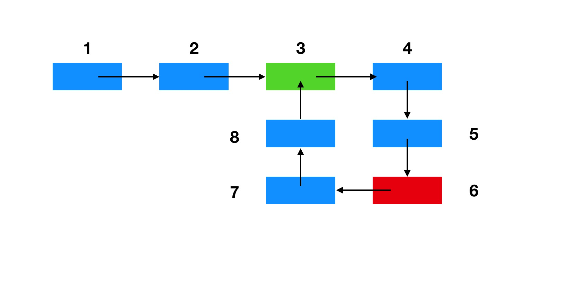

# 142. Linked List Cycle II
## Problems:
Given a linked list, return the node where the cycle begins. If there is no cycle, return null.

## Note: 
Do not modify the linked list.

## Solution:
题目的意思是有个链表，其中一部分有循环。那么找出循环开始的那个点。
我们使用快慢指针就可以做到。<br>
快指针：每次都移动两个点。<br>
慢指针：每次都移动一个点.
假设循环链表如下：

这个链表是带有一个循环的。在节点3(绿色)是循环节点开始的节点。
那么我们可以计算出在节点6的时候。快慢指针刚好重合了。慢指针走了6个节点。快指针走了12个节点。<br>
我们列一个公式。设节点1到节点3的距离为X,节点3到节点6的位置为Y。节点6到节点3的位置距离为Z。<br>
刚刚慢指针走的距离是：X + Y<br>
刚刚快指针走的距离是: X + Y + Z + Y
因为快指针每次走的距离都是慢指针的两倍，所以 2*（X + Y） = X + Y + Z + Y 于是 X = Z<br>
由此可以得出结论，当找到快慢指针的汇聚点后，然后一个指针从头开始，一个指针从现在位置开始依次往后移动，最终汇聚的点就是循环链表循环开始的节点。

``` 
public class Solution {
    public ListNode detectCycle(ListNode head) {
        if(head==null){
            return head;
        }
        ListNode slow = head;
        ListNode fast = head;
        while(fast!=null&&slow!=null){
            slow = slow.next;
            fast = fast.next;
            if(fast==null){
                break;
            }
            fast = fast.next;
            if(slow==fast){
                break;
            }
        }
        if(fast==null||slow==null){
            return null;
        }
        fast = head;
        while(fast!=slow){
            fast=fast.next;
            slow=slow.next;
        }
        return fast;
    }
    
}

```